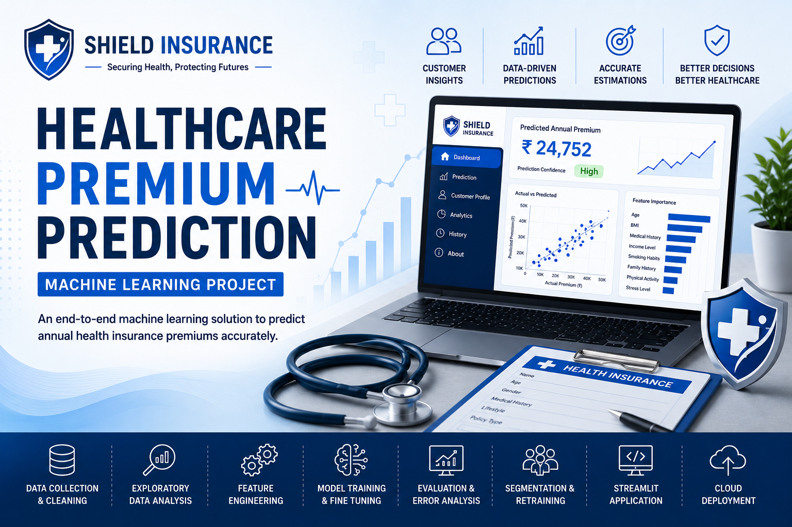
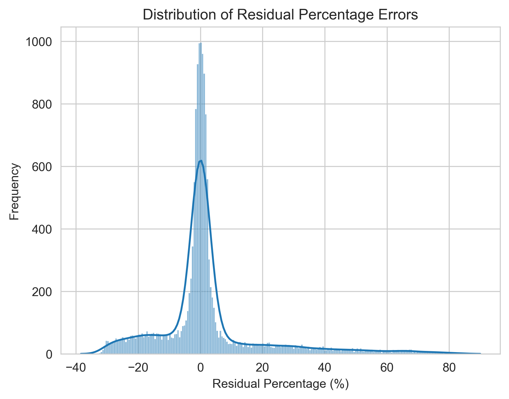
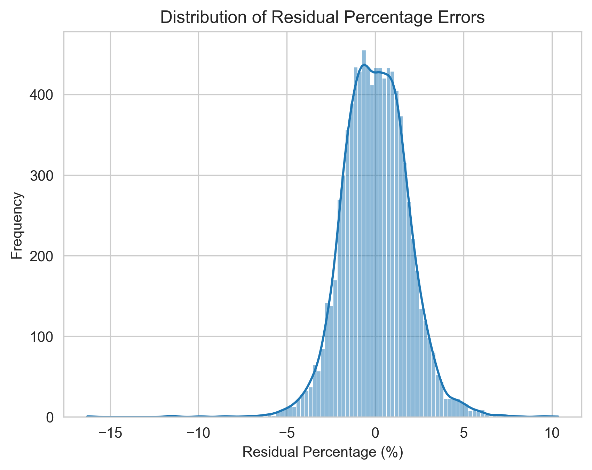
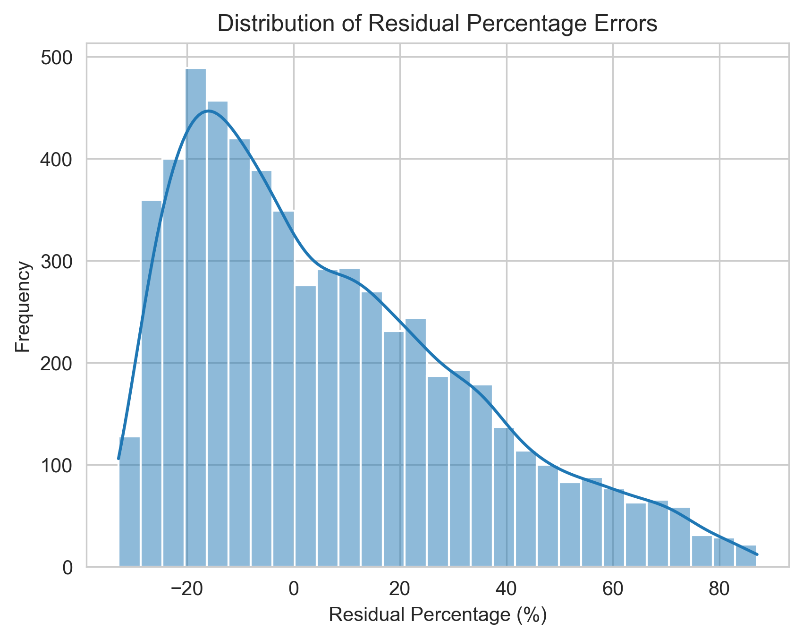
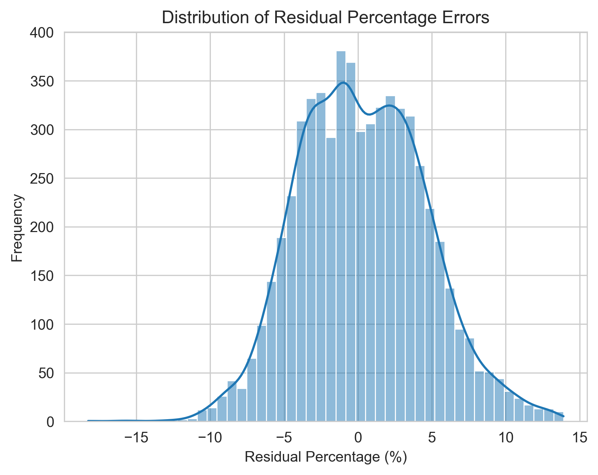
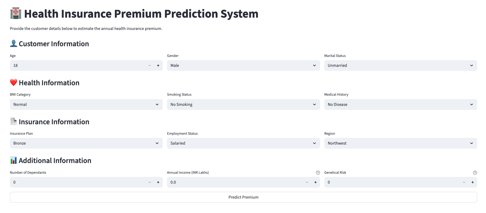

<p align="center">
  
</p>

# 🏥 Healthcare Premium Prediction System
Machine Learning Regression Project for predicting Annual Health Insurance Premiums using Business-Driven Error Analysis and Streamlit Deployment.


## 🌐 Live Application
🔗 **Try the application here:** https://healthcare-premium-prediction-system.streamlit.app

## 📖 1. Project Overview

The **Healthcare Premium Prediction System** is a machine learning regression project developed to estimate annual health insurance premiums based on an individual's demographic, lifestyle, and health-related attributes. The project aims to improve the consistency and accuracy of premium estimation by leveraging data-driven predictive models instead of relying solely on manual assessment.

The project follows a complete end-to-end machine learning workflow, including data preprocessing, exploratory data analysis, feature engineering, model development, hyperparameter tuning, performance evaluation, error analysis, dataset segmentation, model retraining, and deployment. Multiple regression models were developed and evaluated to identify the most suitable solution for different customer segments.

To make the solution accessible and user-friendly, the final trained model was integrated into an interactive **Streamlit** web application, enabling users to input customer information and receive predicted annual health insurance premiums in real time.

This project demonstrates the practical application of machine learning to solve a real-world business problem while showcasing the complete lifecycle of a data science project—from raw data to a deployed predictive application.

---

## 💼 2. Business Problem

Health insurance providers determine annual premium amounts by evaluating various customer attributes, including **age, gender, region, marital status, number of dependants, income level, smoking status, employment status, income level, and genetic risk**. Accurately assessing these factors is essential for estimating fair and competitive insurance premiums.

Traditional premium estimation methods often rely on manual evaluation and predefined business rules, making the process time-consuming, inconsistent, and difficult to scale as the volume of insurance applications increases. These limitations can result in pricing inconsistencies, reduced operational efficiency, and less accurate premium estimates.

To address these challenges, **Shield Insurance** partnered with **AtliQ AI** to develop a machine learning solution capable of predicting annual healthcare insurance premiums with greater accuracy and consistency. By leveraging historical customer data and predictive modeling, the company aims to automate the premium estimation process, improve decision-making, and provide reliable premium predictions for prospective customers.

---

## 🎯 3. Business Objectives

The primary objective of this project is to develop a machine learning solution that accurately predicts annual healthcare insurance premiums based on customer information. The solution is designed to support insurance providers in making faster, more consistent, and data-driven premium estimation decisions.

The project aims to:

- Develop a highly accurate premium prediction model with an overall prediction accuracy exceeding **97%**.
- Ensure that **at least 95% of premium predictions are within a ±10% error margin** of the actual premium amount.
- Develop a robust regression model capable of accurately predicting annual healthcare insurance premiums.
- Improve the consistency and reliability of premium estimation by reducing dependence on manual assessments.
- Analyze customer data to identify the factors that most significantly influence premium costs.
- Evaluate multiple machine learning models and optimize their performance through hyperparameter tuning.
- Enhance prediction accuracy by segmenting the dataset and retraining models for different customer groups.
- Build an interactive Streamlit application that enables users to generate premium predictions through a simple and intuitive interface.
- Deliver a complete end-to-end machine learning solution, from data preprocessing and model development to deployment, that can be integrated into real-world insurance workflows.

---

## ✨ 4. Project Highlights

- Developed an end-to-end **machine learning regression system** for predicting annual healthcare insurance premiums.
- Performed comprehensive **data cleaning, preprocessing, and exploratory data analysis (EDA)** to prepare the dataset for modeling.
- Applied **feature engineering** techniques to improve model performance and predictive accuracy.
- Trained and evaluated multiple **regression algorithms** to identify the best-performing model.
- Optimized model performance through **hyperparameter tuning** and validated results using appropriate evaluation metrics.
- Conducted **error analysis** to identify prediction patterns and areas for model improvement.
- Improved prediction accuracy by **segmenting the dataset** and retraining models for different customer groups.
- Integrated the final trained model into an interactive **Streamlit** web application for real-time premium prediction.
- Built a complete **end-to-end machine learning pipeline**, covering data preparation, model development, evaluation, and deployment.

---

## 🙏 5. Dataset Information & Credit

The dataset used in this project was provided as part of the course **Machine Learning**, conducted by **Codebasics**.

Full credit goes to the **Mr. Dhaval Patel** and the Codebasics team for providing the dataset and learning resources.

> **Note:** The dataset is not publicly available and is therefore not included in this GitHub repository due to sharing restrictions.

This project is created strictly for educational and portfolio demonstration purposes.

---

## 🛠️ 6. Tools and Technologies

The project was developed using the following tools and technologies:

| Category | Tools & Technologies |
|----------|----------------------|
| **Programming Language** | Python 3.13 |
| **Data Manipulation** | Pandas, NumPy |
| **Data Visualization** | Matplotlib, Seaborn |
| **Machine Learning** | Scikit-learn |
| **Statistical Analysis** | Statsmodels |
| **Model Serialization** | Joblib |
| **Interactive Web Application** | Streamlit |
| **Development Environment** | PyCharm (Jupyter Notebook) |
| **Version Control** | Git, GitHub |

---

## 📈 7. Project Evolution

The project was developed through an iterative machine learning workflow, where each stage built upon the insights gained from the previous one. Rather than relying on a single regression model, the solution evolved through continuous analysis, experimentation, and refinement to improve prediction accuracy.

The evolution of the project followed these key stages:

1. **Initial Model Development**
   - Built a baseline regression model using the complete dataset to establish initial performance.

2. **Model Evaluation and Error Analysis**
   - Evaluated the model using appropriate regression metrics and performed residual error analysis to identify prediction patterns and areas for improvement.

3. **Dataset Segmentation**
   - Analyzed the error distribution and segmented the dataset into distinct customer groups to better capture variations in premium prediction.

4. **Request for Additional Data**
   - Identified the need for additional information to improve model performance and incorporated **Genetic Risk** as a new feature for the relevant customer segment.

5. **Model Retraining**
   - Retrained separate machine learning models for each customer segment using the refined datasets, resulting in improved prediction accuracy.

6. **Deployment**
   - Integrated the final trained models into an interactive Streamlit application, enabling users to predict annual healthcare insurance premiums through a simple web interface.

---

## 📂 8. Project Structure

### 8.1 Folder Structure

```text
Healthcare_Premium_Prediction_Regression/
│
├── app/
│   ├── main.py
│   ├── prediction_helper.py
│   └── artifacts/
│       ├── model_rest.joblib
│       ├── model_young.joblib
│       ├── scaler_rest.joblib
│       └── scaler_young.joblib
│
├── notebook_files/
│   ├── full_data_analysis.ipynb
│   ├── dataset_segmentation.ipynb
│   ├── adult_model.ipynb
│   ├── young_model.ipynb
│   ├── adult_model_with_dummy_genetical_risk.ipynb
│   └── young_model_with_genetical_risk.ipynb
│
├── images/
│   ├── full_data_analysis_residual_errors.png
│   ├── adult_model_residual_errors.png
│   ├── young_model_residual_errors.png
│   ├── adult_model_with_dummy_genetical_risk_residual_errors.png
│   ├── young_model_with_genetical_risk_residual_errors.png
│   └── streamlit_dashboard.png
│
├── assets/
│   └── project_banner.png
│
├── .gitignore
├── requirements.txt
└── README.md
```

### 8.2 Project Data Flow

```text
Raw Dataset
      │
      ▼
Data Cleaning & Exploratory Data Analysis (EDA)
      │
      ▼
Feature Engineering
      │
      ▼
Model Training & Fine-Tuning
      │
      ▼
Model Evaluation
      │
      ▼
Error Analysis
      │
      ▼
Dataset Segmentation
      │
      ▼
Request for Additional Data
      │
      ▼
Model Retraining
      │
      ▼
Trained Models & Scalers (.joblib)
      │
      ▼
Streamlit Application
      │
      ▼
Annual Healthcare Insurance Premium Prediction
```

---

## 🔄 9. Project Workflow

The Healthcare Premium Prediction System was developed following a structured end-to-end machine learning workflow. Each phase focused on transforming raw data into a reliable and deployable predictive solution. The workflow consisted of the following stages:

1. Data Collection
2. Data Cleaning & Exploratory Data Analysis (EDA)
3. Feature Engineering
4. Model Training & Fine-Tuning
5. Model Accuracy Check
6. Error Analysis
7. Model Segmentation
8. Request for More Data
9. Model Retraining

### 9.1 Data Collection

The project utilizes an existing healthcare insurance dataset consisting of **13 attributes**, where each record represents an individual customer. The dataset contains demographic, health, employment, financial, and insurance-related information required to develop machine learning models for predicting annual healthcare insurance premiums.

The dataset includes the following attributes:

| Attribute | Description |
|----------|-------------|
| **Age** | Age of the customer |
| **Gender** | Male, Female |
| **Region** | Northeast, Northwest, Southeast, Southwest |
| **Marital Status** | Married, Unmarried |
| **Number of Dependants** | Number of dependants |
| **BMI Category** | Normal, Obesity, Overweight, Underweight |
| **Smoking Status** | No Smoking, Regular, Occasional, Does Not Smoke, Not Smoking, Smoking = 0 |
| **Employment Status** | Freelancer, Salaried, Self-employed |
| **Income Level** | <10L, 10L–25L, 25L–40L, >40L |
| **Income (Lakhs)** | Annual income in lakhs |
| **Medical History** | Diabetes, High Blood Pressure, Heart Disease, Thyroid, combinations of diseases, or No Disease |
| **Insurance Plan** | Bronze, Silver, Gold |
| **Annual Premium Amount** | Target variable representing the customer's annual healthcare insurance premium |

### 9.2 Data Cleaning & Exploratory Data Analysis (EDA)

After obtaining the dataset, a comprehensive data cleaning and exploratory data analysis (EDA) process was performed to ensure the data was suitable for machine learning model development.

#### 9.2.1 Data Cleaning

The following preprocessing steps were carried out:

- Examined the dataset structure, data types, and feature distributions.
- Checked for missing values and verified the completeness of the dataset.
- Identified and removed duplicate records to maintain data integrity.
- Standardized inconsistent categorical values to ensure uniformity across the dataset (e.g., smoking status categories).
- Validated feature values and corrected inconsistencies where necessary.
- Prepared the dataset for feature engineering and model training.

#### 9.2.2 Exploratory Data Analysis (EDA)

Exploratory data analysis was conducted to better understand the dataset and identify the factors influencing healthcare insurance premiums. The analysis included:

- Statistical summary of numerical features.
- Distribution analysis of customer demographics and insurance-related attributes.
- Univariate and bivariate analysis to understand feature characteristics.
- Correlation analysis to examine relationships between numerical variables.
- Visualization of premium trends across different customer groups.
- Identification of key features influencing annual healthcare insurance premiums.
- Detection of potential patterns, anomalies, and outliers that could impact model performance.

The insights obtained during this phase guided the subsequent feature engineering and model development stages.

### 9.3 Feature Engineering

Feature engineering was performed to transform the cleaned dataset into a format suitable for machine learning algorithms. This stage focused on preparing the features while preserving the underlying information required for accurate premium prediction.

The following feature engineering techniques were applied:

- Encoded categorical variables into numerical representations using appropriate encoding techniques.
- Separated the input features from the target variable to prepare the dataset for supervised machine learning.
- Split the dataset into training and testing sets to enable unbiased model evaluation.
- Applied feature scaling to numerical attributes where required to ensure consistent feature representation.
- Saved the fitted scaler objects for use during model inference in the deployed Streamlit application.

These transformations ensured that the dataset was properly prepared for model training while maintaining consistency between the training pipeline and the deployed application.

### 9.4 Model Training & Fine-Tuning

After completing feature engineering, multiple regression models were trained and evaluated to identify the most suitable algorithm for predicting annual healthcare insurance premiums.

The model development process evolved through multiple stages:

- Trained **Linear Regression**, **Ridge Regression**, and **Random Forest Regressor** on the complete dataset.
- Compared the performance of all models and selected the best-performing algorithm based on the evaluation metrics.
- Applied **RandomizedSearchCV** to optimize the hyperparameters of the Random Forest Regressor, further improving its predictive performance.
- After identifying limitations in the initial model, the dataset was segmented into **Adult** and **Young** customer groups, and separate models were developed for each segment.
- Trained and evaluated Linear Regression, Ridge Regression, and Random Forest Regressor independently for both customer segments.
- The Adult model achieved satisfactory performance, whereas the Young model required further improvement.
- Following the error analysis, additional **Genetic Risk** data was requested specifically for the Young dataset.
- Retrained the Young model using the newly available Genetic Risk feature, resulting in a significant improvement in prediction accuracy.
- To maintain a consistent feature structure across both deployment models, a dummy **Genetic Risk = 0** feature was introduced into the Adult dataset before retraining. The Adult model's performance remained unchanged, confirming that the additional feature had no impact on its predictions.
- Saved the final trained models and preprocessing artifacts for deployment in the Streamlit application.

#### 9.4.1 Best Performing Models

| Dataset | Best Performing Model |
|----------|------------------------|
| Full Dataset | Random Forest Regressor |
| Adult Dataset | Random Forest Regressor |
| Young Dataset | Random Forest Regressor |
| Adult Dataset (with Dummy Genetic Risk) | Random Forest Regressor |
| Young Dataset (with Genetic Risk) | Linear Regression |

### 9.5 Model Accuracy Check

After training the regression models, their predictive performance was evaluated using multiple regression evaluation metrics. These metrics were used to measure prediction accuracy, assess model generalization, and compare the performance of different algorithms throughout the project.

The following evaluation metrics were used:

- **Training R² Score:** Measured how well the model learned the patterns in the training dataset.
- **Testing R² Score:** Evaluated the model's ability to generalize to unseen data and helped identify potential overfitting or underfitting.
- **Mean Squared Error (MSE):** Calculated the average squared difference between the predicted and actual premium values.
- **Root Mean Squared Error (RMSE):** Measured the average prediction error in the same unit as the target variable, making the results easier to interpret.

The evaluation results were used to compare the regression models and select the best-performing model for each stage of the project.

### 9.6 Error Analysis

Following model evaluation, a detailed residual error analysis was conducted to identify prediction patterns and uncover opportunities for improving model performance.

The following activities were performed during this phase:

- Analyzed the residual errors by comparing the predicted premium values with the actual premium values.
- Examined the distribution of residuals to assess the quality and consistency of model predictions.
- Identified that the **Young** customer segment exhibited relatively higher residual errors than the **Adult** customer segment.
- Determined that the existing features were insufficient to accurately capture the factors influencing premiums for younger customers.
- Used these findings to justify dataset segmentation and the request for additional **Genetic Risk** information for the Young dataset.
- Leveraged the insights gained from the residual analysis to guide the subsequent model improvement and retraining process.

The residual error analysis played a key role in identifying the limitations of the initial models and driving the improvements implemented in the later stages of the project.

### 9.7 Model Segmentation

Based on the findings from the residual error analysis, the dataset was segmented to improve prediction accuracy by developing specialized models for different customer groups.

The following activities were performed during this phase:

- Divided the dataset into two customer segments based on age:
  - **Adult Dataset**
  - **Young Dataset**
- Trained and evaluated separate regression models for each customer segment.
- Compared the performance of the segmented models with the model trained on the complete dataset.
- Observed that the Adult model achieved satisfactory prediction performance, while the Young model continued to exhibit relatively higher residual errors.
- Concluded that additional information was required to improve the predictive performance of the Young model.

The segmentation process provided valuable insights into the differing characteristics of customer groups and established the foundation for requesting additional data to further improve the Young model.

### 9.8 Request for More Data

Following the dataset segmentation, the Young model continued to exhibit higher residual errors compared to the Adult model. This indicated that the existing features were insufficient to accurately capture the factors influencing healthcare insurance premiums for younger customers.

To address this limitation, additional domain-specific information was requested for the Young dataset.

The following activities were performed during this phase:

- Reviewed the results of the residual error analysis for the Young customer segment.
- Identified the need for additional predictive information to improve model performance.
- Requested **Genetic Risk** data as an additional feature for the Young dataset.
- Received the updated dataset containing the newly introduced **Genetic Risk** feature.
- Prepared the updated Young dataset containing the Genetic Risk feature for model retraining.

The inclusion of the Genetic Risk feature provided valuable information for predicting premiums among younger customers and laid the foundation for improving the model's predictive performance.

### 9.9 Model Retraining

After receiving the additional **Genetic Risk** data, the models were retrained to improve prediction accuracy and ensure a consistent deployment pipeline.

The following activities were performed during this phase:

- Retrained the Young customer model using the updated dataset containing the **Genetic Risk** feature.
- Trained and evaluated multiple regression models, including **Linear Regression**, **Ridge Regression**, and **Random Forest Regressor**, using the Young dataset with the newly added **Genetic Risk** feature.
- Selected **Linear Regression** as the best-performing model for the Young dataset with Genetic Risk based on the evaluation metrics.
- Introduced a dummy **Genetic Risk = 0** feature into the Adult dataset to maintain a consistent feature structure across both deployment models.
- Retrained the Adult model using the updated feature set and confirmed that its predictive performance remained unchanged.
- Saved the final trained models and preprocessing artifacts for deployment in the Streamlit application.

The retraining process significantly improved the prediction performance of the Young model while ensuring a unified input structure for both Adult and Young models during deployment.

---

## 📊 10. Results

The project followed an iterative machine learning workflow in which residual error analysis was used to identify model limitations and guide subsequent improvements. Each iteration progressively reduced extreme prediction errors and improved the model's overall reliability.

### 10.1 Full Dataset Model

The initial model achieved strong overall performance based on the evaluation metrics. However, residual error analysis revealed that:

- Approximately **29.53%** of customers (**4,421 out of 14,973**) had prediction errors greater than **±10%**.
- Approximately **519 customers** had prediction errors exceeding **±50%**.

These findings indicated that, despite achieving a good overall model score, the model was not suitable for deployment because a significant number of customers could be substantially overcharged or undercharged.

<p align="center">
  
</p>

### 10.2 Adult Dataset Model

Following age-based model segmentation, a dedicated model was trained for customers older than 25 years.

The results showed:

- Only **0.0782%** of customers (**7 out of 8,947**) had prediction errors greater than **±10%**.

These results confirmed that the model performed well for the adult population and required no further improvements.

<p align="center">
  
</p>

### 10.3 Young Dataset Model

A separate model was developed for customers aged 25 years and below.

Residual error analysis showed that:

- **73.32%** of customers (**4,418 out of 6,026**) had prediction errors greater than **±10%**.

Further investigation did not reveal any meaningful patterns from the available features, indicating that the existing data was insufficient to accurately predict premiums for younger customers.

<p align="center">
  
</p>

### 10.4 Young Dataset Model (with Genetic Risk)

After incorporating the **Genetic Risk** feature into the Young dataset, the model was retrained.

The updated model delivered a significant improvement:

- Extreme prediction errors reduced from **73.32%** to **2.14%**.
- Only **129 out of 6,026** customers had prediction errors greater than **±10%**.
- The final model explained **98.83%** of the variance in the target variable.

These results demonstrate that **Genetic Risk** is a highly informative feature for predicting healthcare insurance premiums among younger customers.

<p align="center">
  
</p>

### 10.5 Adult Dataset Model (Dummy Genetic Risk)

To maintain a consistent feature structure across both deployment models, a dummy **Genetic Risk = 0** feature was added to the Adult dataset before retraining.

The model's performance remained unchanged:

- Only **0.0782%** of customers (**7 out of 8,947**) had prediction errors greater than **±10%**.

This confirmed that adding the dummy feature preserved the model's performance while ensuring a consistent preprocessing pipeline for deployment.

<p align="center">
  
</p>

### 10.6 Key Outcomes

- Residual error analysis revealed limitations that were not apparent from the overall evaluation metrics alone.
- Age-based model segmentation significantly improved prediction accuracy for customers older than 25 years.
- Analysis of the Young customer segment highlighted the need for additional business data.
- Introducing the **Genetic Risk** feature reduced extreme prediction errors from **73.32%** to **2.14%**, resulting in a substantial improvement in prediction accuracy.
- The final solution consists of two optimized models with a consistent preprocessing pipeline, enabling reliable deployment through the Streamlit application.

---

## 🖥️ 11. Streamlit Dashboard

An interactive Streamlit application was developed to provide a simple and user-friendly interface for predicting annual healthcare insurance premiums.

The application allows users to enter customer demographic, financial, medical, and insurance information through an intuitive web interface. Based on the customer's age, the application automatically selects the appropriate trained model and generates a predicted annual healthcare insurance premium.

### 11.1 Key Features

- User-friendly interface for entering customer information.
- Automatic selection of the appropriate prediction model based on the customer's age.
- Consistent preprocessing using the saved scaler objects.
- Real-time annual healthcare insurance premium prediction.
- Fast and reliable predictions without requiring any machine learning knowledge from the end user.

<p align="center">
  
</p>

---

## ☁️ 12. Deployment

The Healthcare Premium Prediction application has been successfully deployed to the cloud, making the prediction system accessible through any modern web browser without requiring any local installation.

The deployed application provides:

- An interactive and user-friendly interface for entering customer information.
- Automatic selection of the appropriate prediction model based on the customer's age.
- Consistent data preprocessing using the saved scaler objects.
- Real-time annual healthcare insurance premium predictions.
- Fast, reliable, and consistent predictions powered by the trained machine learning models.

🔗 **Live Application:** https://healthcare-premium-prediction-system.streamlit.app

---

## 📌 13. Key Takeaways

- Successfully developed an end-to-end machine learning solution for predicting annual healthcare insurance premiums.
- Demonstrated the complete machine learning workflow, from data preprocessing and exploratory data analysis to model development, evaluation, deployment, and application development.
- Showed the importance of residual error analysis in identifying model limitations that were not apparent from evaluation metrics alone.
- Improved prediction performance by segmenting the dataset into Adult and Young customer groups and training specialized models for each segment.
- Enhanced the Young customer model by incorporating the **Genetic Risk** feature, significantly reducing prediction errors.
- Applied hyperparameter tuning to optimize model performance and select the most effective algorithms for each stage of the project.
- Built and deployed an interactive Streamlit application that enables users to generate real-time healthcare insurance premium predictions through a simple web interface.
- Demonstrated how machine learning can support more accurate, consistent, and data-driven decision-making in the healthcare insurance industry.

---

## 💡 14. Skills Demonstrated

- End-to-end machine learning project development.
- Data cleaning and preprocessing using Pandas and NumPy.
- Exploratory Data Analysis (EDA) and data visualization.
- Feature engineering and categorical data encoding.
- Regression model development using Scikit-learn.
- Model evaluation using R² Score, MSE, and RMSE.
- Hyperparameter tuning using RandomizedSearchCV.
- Residual error analysis and model performance interpretation.
- Dataset segmentation and specialized model development.
- Business-driven model improvement through iterative retraining.
- Model serialization using Joblib.
- Interactive web application development with Streamlit.
- Version control using Git and GitHub.
- Cloud deployment of machine learning applications.

---

## 🚀 15. How to Run the Project

### 15.1 Clone the Repository

    Clone this repository to your local machine.

### 15.2 Install the Required Dependencies

```bash
  pip install -r requirements.txt
```

### 15.3 Launch the Streamlit Application

```bash
  streamlit run app/main.py
```

### 15.4 Access the Application

    Once the Streamlit application starts successfully, it will be available in your web browser, allowing you to generate healthcare insurance premium predictions through the interactive interface.

---

## 🚀 16. Future Improvements

- Expand the dataset with additional customer and healthcare-related features to further improve prediction accuracy.
- Explore advanced machine learning models, such as Gradient Boosting, XGBoost, and LightGBM, for performance comparison.
- Incorporate model explainability techniques, such as SHAP or LIME, to provide insights into individual premium predictions.
- Integrate the prediction system with a database to enable persistent storage and management of customer information.
- Develop a REST API to facilitate integration with external insurance management systems.
- Implement automated model retraining pipelines to support continuous learning as new data becomes available.

---

## 🎉 17. Final Conclusion

The Healthcare Premium Prediction project demonstrates a complete end-to-end machine learning workflow, from data preprocessing and exploratory data analysis to model development, evaluation, deployment, and application development. By combining data-driven insights with iterative model improvement techniques such as residual error analysis, dataset segmentation, and model retraining, the project successfully improved prediction accuracy and addressed the unique characteristics of different customer groups.

The final solution provides an interactive Streamlit application capable of generating reliable annual healthcare insurance premium predictions, showcasing how machine learning can support faster, more consistent, and data-driven decision-making in the healthcare insurance industry.

This project not only highlights practical machine learning and software development skills but also demonstrates the importance of applying analytical thinking and business understanding to solve real-world problems effectively.
